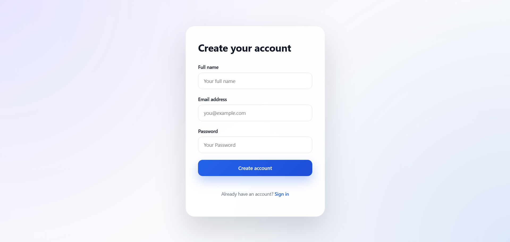
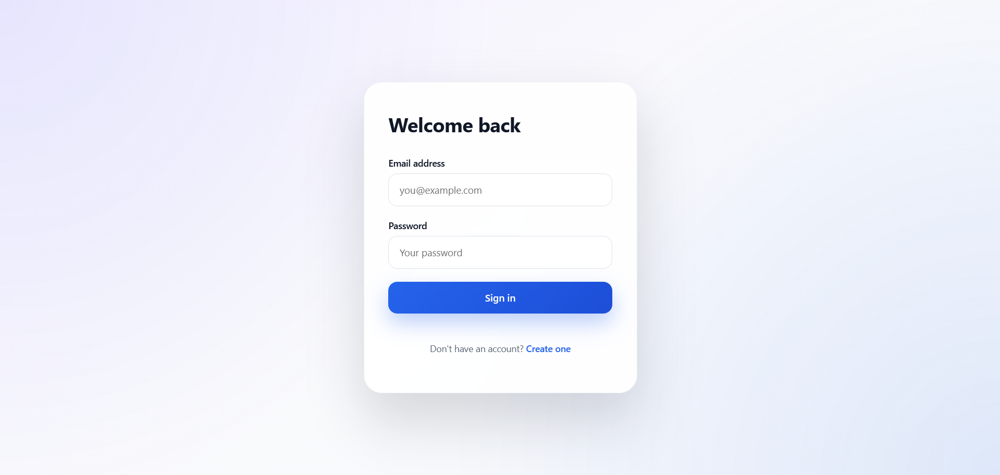
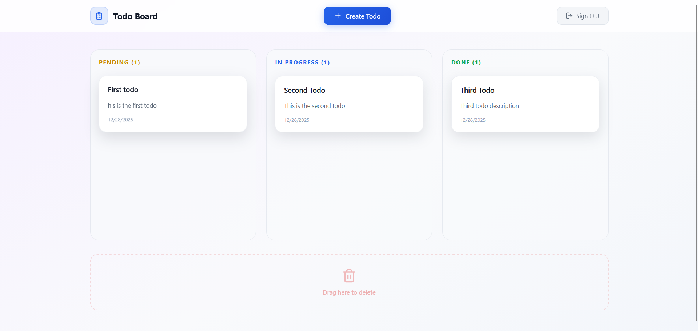
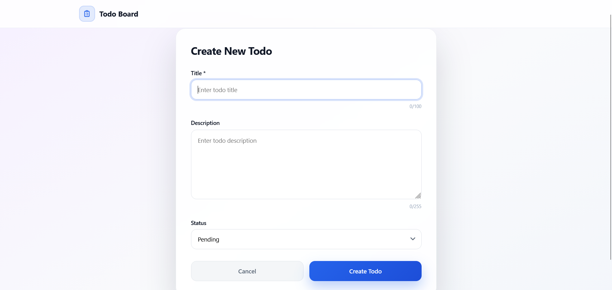
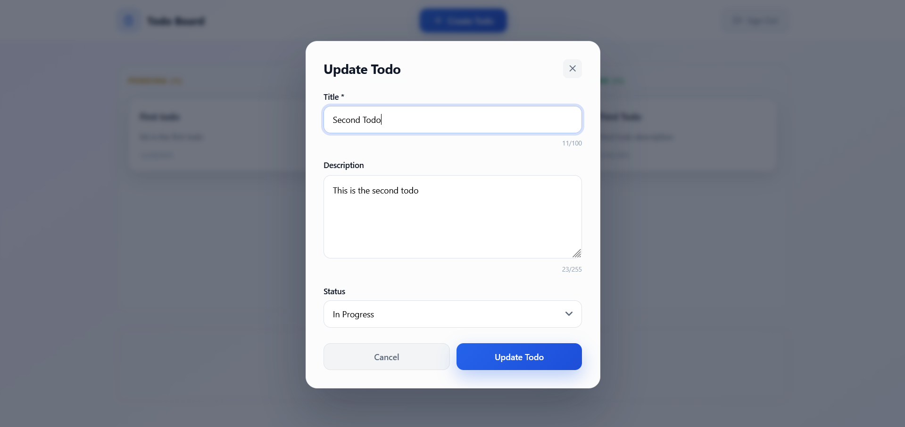

# Task Management Application

A full-stack task management application with a Jira board interface, built with React (frontend) and NestJS (backend).

## Features

- User authentication (Register, Login, Logout)
- Create, read, update, and delete todos
- Jira board with drag-and-drop functionality
- Fully responsive design
- Real-time status updates via drag-and-drop

## Tech Stack

### Frontend
- **React** - UI library
- **TypeScript** - Type safety
- **Axios** - HTTP client

### Backend
- **NestJS** - Node.js framework
- **TypeScript** - Type safety
- **PostgreSQL** - Database
- **JWT** - Authentication
- **bcrypt** - Password hashing

## Prerequisites

Before you begin, ensure you have the following installed:

- **Node.js** (v18 or higher)
- **npm**
- **PostgreSQL** (v12 or higher)
- **Git**

## Setup Instructions

### 1. Clone the Repository

```bash
git clone <repository-url>
cd Rawmart-Todo
```

### 2. Backend Setup

```bash
# Navigate to backend directory
cd backend

# Install dependencies
npm install

```

Create a `.env` file in the `backend` directory with the following variables:

```env
DB_HOST=localhost
DB_PORT=5432
DB_USERNAME=your_db_username
DB_PASSWORD=your_db_password
DB_DATABASE=your_database_name
JWT_SECRET=your_jwt_secret_key
JWT_EXPIRES_IN=24h
```

### 3. Database Setup

```bash
# Create a PostgreSQL database
createdb your_database_name

# Or using psql:
psql -U postgres
CREATE DATABASE your_database_name;
```

### 4. Frontend Setup

```bash
# Navigate to frontend directory (from project root)
cd frontend

# Install dependencies
npm install

```

Create a `.env` file in the `frontend` directory:

```env
VITE_BACKEND_URL=http://localhost:3000/api/v1
```

## How to Run the Project

### Backend

```bash
# Navigate to backend directory
cd backend

# Run in development mode
npm run dev

# The backend will start on http://localhost:3000
# API will be available at http://localhost:3000/api/v1
```

### Frontend

```bash
# Navigate to frontend directory (from project root)
cd frontend

# Run in development mode
npm run dev

# The frontend will start on http://localhost:5173 (or another port if 5173 is busy)
```


## API Endpoints

All API endpoints are prefixed with `/api/v1`.

### Authentication Endpoints

#### Register
- **POST** `/api/v1/auth/register`
- **Description:** Register a new user

#### Login
- **POST** `/api/v1/auth/login`
- **Description:** Authenticate user and get access token

#### Logout
- **POST** `/api/v1/auth/logout`
- **Description:** Logout user (requires authentication)

### Todo Endpoints

All todo endpoints require authentication. Include the JWT token in the Authorization header:
```
Authorization: Bearer <access_token>
```

#### Create Todo
- **POST** `/api/v1/user/:userId/todo/`
- **Description:** Create a new todo
- **URL Parameters:**
  - `userId` (number)` - The ID of the user

#### Get All Todos
- **GET** `/api/v1/user/:userId/todo/`
- **Description:** Get all todos for a user
- **URL Parameters:**
  - `userId` (number) - The ID of the user

#### Get Todo by ID
- **GET** `/api/v1/user/:userId/todo/:todoId`
- **Description:** Get a specific todo by ID
- **URL Parameters:**
  - `userId` (number) - The ID of the user
  - `todoId` (number) - The ID of the todo

#### Update Todo
- **PATCH** `/api/v1/user/:userId/todo/:todoId`
- **Description:** Update a todo (all fields are optional)
- **URL Parameters:**
  - `userId` (number) - The ID of the user
  - `todoId` (number) - The ID of the todo

#### Delete Todo
- **DELETE** `/api/v1/user/:userId/todo/:todoId`
- **Description:** Delete a todo
- **URL Parameters:**
  - `userId` (number) - The ID of the user
  - `todoId` (number) - The ID of the todo

## Project Structure

```
Rawmart-Todo/
├── backend/
│   ├── src/
│   │   ├── modules/
│   │   │   ├── auth/          # Authentication module
│   │   │   ├── todo/           # Todo CRUD operations
│   │   │   └── user/           # User entities
│   │   ├── decorators/         # Custom decorators
│   │   ├── interfaces/         # TypeScript interfaces
│   │   └── main.ts             # Application entry point
│   ├── package.json
│   └── tsconfig.json
│
└── frontend/
    ├── src/
    │   ├── api/                # API client configuration
    │   ├── authentication/     # Login/Register pages
    │   ├── create-todo/        # Create todo page
    │   ├── home/               # Kanban board & todo management
    │   ├── interfaces/         # TypeScript interfaces
    │   └── main.tsx            # Application entry point
    ├── package.json
    └── vite.config.ts
```

## Environment Variables

### Backend (.env)
```env
DB_HOST=localhost
DB_PORT=5432
DB_USERNAME=your_db_username
DB_PASSWORD=your_db_password
DB_DATABASE=your_database_name
JWT_SECRET=your_jwt_secret_key
JWT_EXPIRES_IN=24h
```

### Frontend (.env)
```env
VITE_BACKEND_URL=http://localhost:3000/api/v1
```

## Screenshots

### Register Page


Form to register new user with name, email and password

### Login Page


Form to login with email and password

### Home Page - Kanban Board


The main dashboard showing todos organized in columns (Pending, In Progress, Done) with drag-and-drop functionality.

### Create Todo Page


Form to create new todos with title, description, and status fields.

### Update Todo Modal


Modal popup for editing existing todos.